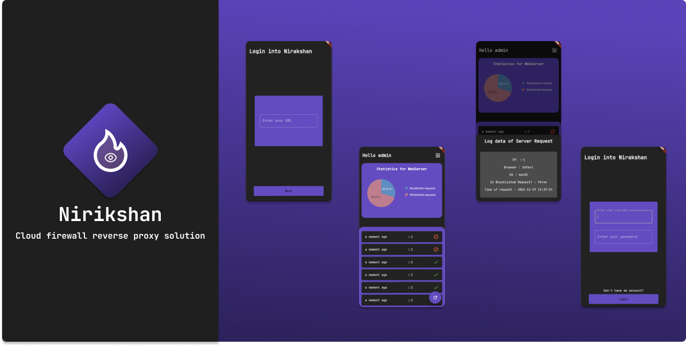

[](https://github.com/Shastram/nirikshan-rekon-app/blob/master/LICENSE)
[](https://github.com/Shastram/nirikshan-rekon-app/issues/new/choose)
# Nirikshan Rekon App

> The Companion Mobile App for nirikshan to view monitoring and audit logs


## Installation

**Step 1:**

Download or clone this repo by using the link below:

```bash
git clone https://github.com/Shastram/nirikshan-rekon-app.git
```

**Step 2:**

Go to project root and execute the following command in console to get the required dependencies: 

```bash
cd nirikshan-rekon-app && flutter pub get 
```

**Step 3:**

Run the app in the Android Emulator

```bash
flutter run
```

## Libraries & Tools Used

* [Dio](https://github.com/flutterchina/dio)
* [Provider](https://github.com/rrousselGit/provider) (State Management)
* [Encryption](https://github.com/xxtea/xxtea-dart)
* [Validation](https://github.com/dart-league/validators)
* [Logging](https://github.com/zubairehman/Flogs)
* [Json Serialization](https://github.com/dart-lang/json_serializable)


## 🤔 What is Nirikshan?

Nirikshan is an cloud firewall reverse proxy with an inbuilt ddos prevention and alerting solution. Does that sound complex? Let's break it down.

- **Cloud:** A system/server that is sitting on the cloud
- **Firewall:** A system that denies/allows a packet based on some instruction and conditional logic
- **Reverse Proxy:** A system that sits in-front of your actual server and forward the request to your actual server safely
- **DDoS Protection:** A system that detects DDoS and contains the attack
- **Alerting:** A system that someone notifies you when it has detected that something has gone wrong
  
Nirikshan is a combination of all these! Yes, you read that right.

Imagine you wanted to block people using iPhone to access your server, or people using Chrome or accessing from IPs of specific location. You can do that all with Nirikshan!

To top it off, there is an inbuilt ddos and rate-limiting mechanism, so if anything suspcious occurs, the Nirikshan Telegram bot will immedietly alert you with all the details after which you can use the companion [Nirikshan Rekon App](https://github.com/Shastram/nirikshan-rekon-app) to monitor and take action.

What are the major advantages of using Nirikshan? 

- **Declarative security policies using YAML**
- Has an companion App that you can use to monitor the requests
- Has an Telegram Bot that will immedieatly alert you if something goes wrong

## ⭐ Show your support

Give a ⭐ if you liked this project!

Spread the word to your fellows to safeguard your API's!

## 🤝 Contributions

- Feel Free to Open a PR/Issue for any feature or bug(s).
- Make sure you follow the [community guidelines](https://docs.github.com/en/github/site-policy/github-community-guidelines)!
- Feel free to open an issue to ask a question/discuss anything about nirikshan.
- Have a feature request? Open an Issue!

## ⚖ License

Copyright 2021 Hemanth Krishna

Licensed under MIT License : https://opensource.org/licenses/MIT

<p align="center">Made with ❤ and multiple cups of coffee</p>
